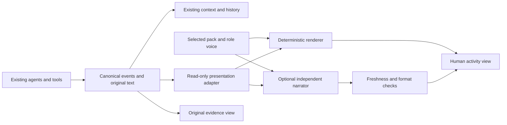

**AISquare personas: implementation survey and revised build plan**

The [final build plan](/Users/surjoyday_kt100/Developer/aisquare-cli/docs/plans/cli-personas-build-plan.md) is now the controlling design, including native work improvements, slash commands and local persona authoring. This document is historical supporting research; its scope, command examples and implementation priorities yield to that plan.

Scope clarification after tracing the user's `asq` → Start manager route: the first release needs a visible narration panel beside/below the Manager terminal, using the same renderer as Board. A Board-only implementation would miss the user's main screen. Ponytail-like working rules remain a distinct behavioral feature; they are not activated by changing a personality pack. The simple plan includes the entry-route matrix and the currently open ui-tester proposal (#112).

September 11, 2026. Research and proposed design only; no persona implementation or external package installation was performed. Local baseline: commit `29e1c3e476d6d7bc3947a290a482485a14f856e2`. Upstream findings below come from primary documentation and source inspection, not reproduced runtime tests. Unless a tag/commit is specified, a link describes the branch inspected on this date and may change.

This document broadens the earlier research beyond prompt-persona projects and generic terminal libraries. It takes precedence for the choice of implementation approach. The [detailed integration plan](/Users/surjoyday_kt100/Developer/aisquare-cli/docs/plans/cli-personas-research.md) remains the reference for existing AISquare code, installation details and the deterministic foundation's tests.

**What the broader research changes**

There are working examples of three useful mechanisms: character output selected from real events; an independent narrator watching another agent; and text transformation confined to the display. They can share persona files and role routing. They do not require changing the manager's, coder's or reviewer's working instructions.

The strongest references are Pi for a display transformation boundary, term-pet for independent commentary, PeonPing/OpenPeon for event packs and distribution, and SillyTavern for explicit separation between displayed and model-visible text. ShellGPT and AIChat supply understandable persona-management flows. Tracery supplies a genuine reusable language-generation library for variation without an LLM. The sections below explain their actual mechanisms and their limits.

The revised recommendation is to build one presentation system with a deterministic foundation and an optional independent narrator. Investigate a transcript presentation surface before promising personality for every native agent reply. This supports a richer product than a collection of canned status lines without requiring an immediate replacement of AISquare's agent terminals.

**1. Pi: the closest CLI example of a display-only transformer**

Pi's released `v0.85.1` exposes `registerMarkdownTransformer()`. A transformer receives display text and rendering context while original session messages and model context remain unchanged. This is a mechanism for building a persona extension; this research did not verify a finished downloadable persona pack using it. The hook must be fast and synchronous because rendering can run during streaming and resizing. [Extension contract](https://github.com/earendil-works/pi/blob/v0.85.1/packages/coding-agent/docs/extensions.md#piregistermarkdowntransformertransformer), [release](https://github.com/earendil-works/pi/releases/tag/v0.85.1).

The implementation is traceable: the [extension loader](https://github.com/earendil-works/pi/blob/v0.85.1/packages/coding-agent/src/core/extensions/loader.ts#L322) registers callbacks; the [runner](https://github.com/earendil-works/pi/blob/v0.85.1/packages/coding-agent/src/core/extensions/runner.ts#L599) collects them; the [assistant component](https://github.com/earendil-works/pi/blob/v0.85.1/packages/coding-agent/src/modes/interactive/components/assistant-message.ts#L85) retains the original message and supplies a separate Markdown transformation; [the transformation helper](https://github.com/earendil-works/pi/blob/v0.85.1/packages/coding-agent/src/modes/interactive/components/markdown-transform.ts) chains transformations and retains the preceding display text when a callback throws.

Pi also distinguishes custom transcript entries from custom messages. `appendEntry()` with an entry renderer can add a display card outside model context. `sendMessage()` is different: its custom messages are converted into user messages for the model, even if hidden from display. [Message conversion](https://github.com/earendil-works/pi/blob/v0.85.1/packages/coding-agent/src/core/messages.ts#L153), [API types](https://github.com/earendil-works/pi/blob/v0.85.1/packages/coding-agent/src/core/extensions/types.ts).

**Apply to AISquare:** adopt the original-message/display-result separation and exception fallback. Do not make network requests inside rendering. Role identity must come from AISquare's session metadata. Pi's API cannot reach inside another vendor's tmux pane; using it directly would require a Pi agent backend. Pi is [MIT](https://github.com/earendil-works/pi/blob/v0.85.1/LICENSE); its [extension packages](https://github.com/earendil-works/pi/blob/v0.85.1/packages/coding-agent/docs/packages.md) can contain executable code, so their distribution model is broader than the proposed data-only packs.

**2. term-pet: an independent personality model beside the working agent**

term-pet watches Claude session JSONL. Its [watcher](https://github.com/paulrobello/term-pet/blob/main/src/tpet/monitor/watcher.py) tracks file positions and queues new events; its [parser](https://github.com/paulrobello/term-pet/blob/main/src/tpet/monitor/parser.py) extracts conversation text while filtering tool/internal records. A separate model creates commentary for a terminal pet. This is a concrete route to varied, contextual speech without adding personality to the coding agent's prompt.

The [commentary generator](https://github.com/paulrobello/term-pet/blob/main/src/tpet/commentary/generator.py) uses background execution and bounds the result. Its [prompts](https://github.com/paulrobello/term-pet/blob/main/src/tpet/commentary/prompts.py) combine character traits with watched content. The [application](https://github.com/paulrobello/term-pet/blob/main/src/tpet/app.py) throttles commentary and permits a single event-comment future in flight. It does not establish that a completed comment still describes the latest task state.

**Apply to AISquare:** consume canonical board events first, where roles and task states are known. Generate short supplementary narration asynchronously. Correlate each request with source event, task state and selected pack version; reject stale responses. This avoids a manager voice announcing that testing has started after the task has already failed.

Do not copy the SDK options as proof of isolation: `allowed_tools=[]` is not by itself proof that no tools are available. Prefer a text-generation request with no tools supplied and no access to the working agent's session. term-pet's published package requires Python >=3.13, whereas AISquare supports >=3.11; it is an architectural reference rather than a drop-in dependency. [Published package and MIT metadata](https://pypi.org/project/term-pet/).

**3. PeonPing and OpenPeon: event characters, variation and downloadable packs**

PeonPing's [hook implementation](https://github.com/PeonPing/peon-ping/blob/main/peon.sh) maps agent events to character sound categories, selects a pack, avoids immediate repeats and debounces noisy notifications. Its [tests](https://github.com/PeonPing/peon-ping/blob/main/tests/peon.bats) cover switching, invalid selections, repetition and notification timing. It is a useful working example of personality attached to actual activity rather than instructions to act differently.

OpenPeon's [CESP specification](https://github.com/PeonPing/openpeon/blob/main/spec/cesp-v1.md) defines categories such as session start, work acknowledgement, completion, error and required input. Its [JSON schema](https://github.com/PeonPing/openpeon/blob/main/spec/openpeon.schema.json) supplies versioned identity, author/license metadata, categorized assets and optional checksums. PeonPing's [shared downloader](https://github.com/PeonPing/peon-ping/blob/main/scripts/pack-download.sh) serves installation and later downloads, using a [registry](https://github.com/PeonPing/registry) and local cached assets.

**Apply to AISquare:** one manifest, one installation service, previews, provenance, version pinning and event-category variants. Reuse the architecture with text as the first output. Sound can become an optional field later; it is not needed for the proposed demo.

Preserve AISquare's event semantics: a native agent stopping is not proof of accepted work. Use actual claim/review/reopen/done records. PeonPing's optional [MCP integration](https://github.com/PeonPing/peon-ping/blob/main/mcp/peon-mcp.js) exposes sound tools to the agent; that mode has a different boundary from passive hooks. Repository code is MIT, while downloaded sound assets have their own licenses. [Repository](https://github.com/PeonPing/peon-ping).

**4. SillyTavern: display transformations and prompt transformations are different paths**

SillyTavern is a character-chat application rather than a CLI, but its implementation answers the important architectural question. The [regex engine](https://github.com/SillyTavern/SillyTavern/blob/release/public/scripts/extensions/regex/engine.js) receives separate `isMarkdown` and `isPrompt` flags and tests the script's `markdownOnly`/`promptOnly` settings. In [the application](https://github.com/SillyTavern/SillyTavern/blob/release/public/script.js), rendering invokes the display path while outgoing message construction invokes the prompt path.

The [documentation](https://github.com/SillyTavern/SillyTavern-Docs/blob/main/extensions/Regex.md) explains the consequence: display-only transforms can leave stored chat untouched; default transformations can modify persisted messages. A transformation being called an output filter does not establish isolation.

**Apply to AISquare:** separate original content from display content in the types and call sites, not just in comments or prompts. Keep copy-original/export-original available. Do not use unrestricted regex substitutions across code, commands, numbers, negations or verdicts. This is an architectural reference; SillyTavern's [AGPL-3.0 license](https://github.com/SillyTavern/SillyTavern/blob/release/LICENSE) differs from AISquare's MIT license.

**5. OpenCode, Crush and termvis: where presentation actually lives**

| Project | Source finding | Useful adaptation |
| --- | --- | --- |
| OpenCode | The current `dev` [TUI plugin contract](https://github.com/anomalyco/opencode/blob/dev/packages/plugin/src/tui.ts) exposes selection, keymaps, saved UI values, events and slots. Declared slots cover app/prompt/sidebar/footer, not built-in assistant text. | A persona picker and separate narration surface can be presentation plugins. Verify release availability before targeting this API. |
| OpenCode | [`experimental.text.complete`](https://github.com/anomalyco/opencode/blob/dev/packages/opencode/src/session/processor.ts#L495) changes the canonical text and persists it. The downstream [TextPart renderer](https://github.com/anomalyco/opencode/blob/dev/packages/tui/src/routes/session/index.tsx#L1624) is a different layer. | Do not confuse an output completion hook with a display-only hook. |
| Crush | Its [assistant display item](https://github.com/charmbracelet/crush/blob/main/internal/ui/chat/assistant.go) reads original message text, caches rendered Markdown and copies original text. [Theme updates](https://github.com/charmbracelet/crush/blob/main/internal/ui/model/ui.go#L3964) invalidate rendering caches. | Retain canonical messages; recompute only the view when a persona switches. |
| termvis | Its [PTY runtime](https://github.com/Joker-of-Gotham/termvis/blob/d03a71a3f7963948913e8cd87857f5985253d311/src/life/runtime.js) gives a companion a separate viewport beside the host application. | A narrow companion area can make personalities visible without replacing the embedded terminal. |

OpenCode's [themes](https://opencode.ai/docs/themes/) and [plugin distribution](https://opencode.ai/docs/plugins/) also demonstrate live selection and project/global discovery. Color themes themselves do not provide verbal personalities. OpenCode is [MIT](https://github.com/anomalyco/opencode/blob/dev/LICENSE). Crush's current [FSL-1.1-MIT license](https://github.com/charmbracelet/crush/blob/main/LICENSE.md) has a future MIT grant; classify it as source-visible, not currently a permissively licensed runtime dependency.

termvis has an independent [speech/style pipeline](https://github.com/Joker-of-Gotham/termvis/blob/main/src/cognition/pipeline/prompts.js), but its [Claude adapter](https://github.com/Joker-of-Gotham/termvis/blob/main/src/adapters/claude-code.js) also registers MCP/skill guidance with the host. These integration modes have different effects on worker inputs. Source inspection of the PTY runtime additionally found nested output-listener registration that merits investigation; it was not runtime-tested. Its [manifest](https://github.com/Joker-of-Gotham/termvis/blob/main/package.json) declares MIT, but a standalone license was not established in the inspected tree. Use the companion-layout idea; do not adopt this runtime wholesale.

**6. AIChat, ShellGPT and Mods: persona management worth learning from**

These applications implement character roles by changing model requests. Their management and rendering patterns are useful; their persona activation mechanism does not meet the strict response-only constraint.

| Project | Traced implementation | Reuse decision |
| --- | --- | --- |
| AIChat | [Role files](https://github.com/sigoden/aichat/blob/main/src/config/role.rs) parse Markdown/YAML, including model parameters and tools. [Configuration](https://github.com/sigoden/aichat/blob/main/src/config/mod.rs) loads local or built-in roles and restricts switching in active/nonempty sessions. | Borrow discovery, inspect/export/edit and explicit lifecycle rules. Omit all model/tool fields from AISquare presentation packs. |
| ShellGPT | [Typer commands](https://github.com/TheR1D/shell_gpt/blob/main/sgpt/app.py) create/show/list/select JSON [system roles](https://github.com/TheR1D/shell_gpt/blob/main/sgpt/role.py). Its [default handler](https://github.com/TheR1D/shell_gpt/blob/main/sgpt/handlers/default_handler.py) inserts the selected role into the system message. | Closest language-level reference for a small Python management surface. Do not import its global provider setup or prompt-bearing roles. |
| Mods | [Configuration](https://github.com/charmbracelet/mods/blob/main/config.go) maps roles to text. [Loading](https://github.com/charmbracelet/mods/blob/main/load.go) supports literal/file/URL input; [stream setup](https://github.com/charmbracelet/mods/blob/main/stream.go) turns role text into system messages. | Borrow the separation of configuration, transport and view. Implement bounded pack downloading rather than copying the bare URL reader. |

ShellGPT's [printers](https://github.com/TheR1D/shell_gpt/blob/main/sgpt/printer.py) separate Rich display from accumulated generated text; its [chat handler](https://github.com/TheR1D/shell_gpt/blob/main/sgpt/handlers/chat_handler.py) saves assistant text and rejects changing roles in existing chats. For AISquare's presentation-only personas, changing display mid-session can be supported precisely because it does not change canonical history.

AIChat is [MIT or Apache-2.0](https://github.com/sigoden/aichat/blob/main/Cargo.toml), ShellGPT is [MIT](https://github.com/TheR1D/shell_gpt/blob/main/LICENSE), and Mods is [MIT](https://github.com/charmbracelet/mods/blob/main/LICENSE). Mods was archived in March 2026 and directs users to Crush, so use it as a code study rather than a new dependency. [Maintainer announcement](https://github.com/charmbracelet/mods#sunsetting-mods).

**7. Actual libraries for phrase generation and reusable content**

**Tracery / pytracery.** This is a language-generation library, not another agent framework. A JSON grammar expands named rules into phrases, with reusable subrules and alternatives. The Python port exposes `Grammar`, modifiers and `flatten()`. It can generate role-specific variation without a model request. [Python usage](https://github.com/aparrish/pytracery/blob/master/README.rst), [original project](https://github.com/galaxykate/tracery).

There are concrete adoption constraints: the inspected [Python implementation](https://github.com/aparrish/pytracery/blob/master/tracery/__init__.py) uses the process-global random generator, and `flatten(seed=...)` reseeds it. Escape processing can remove backslashes. Random choice does not itself prevent repeated lines. AISquare should never pass immutable paths, commands or evidence through grammar expansion. If evaluated, isolate expansion, bound rule depth/output, restrict modifiers and insert factual fragments afterward. Its [package metadata](https://github.com/aparrish/pytracery/blob/master/setup.py) identifies Apache-2.0 and an old alpha package; current AISquare Python compatibility remains to be tested.

**Project Fluent / fluent.runtime.** Fluent provides reusable terms, variables and plural/enum selectors, which can reduce duplicated phrase content across role packs and languages. It is a message-formatting system, not an LLM persona engine. [Terms](https://projectfluent.org/fluent/guide/terms.html), [selectors](https://projectfluent.org/fluent/guide/selectors.html).

The Python [fallback implementation](https://github.com/projectfluent/python-fluent/blob/main/fluent.runtime/fluent/runtime/fallback.py) resolves messages through bundles and returns the message ID when missing. Its high-level `format_value` discards formatting errors, so an application needing explicit fallback should handle them at the lower API. The [runtime manifest](https://github.com/projectfluent/python-fluent/blob/main/fluent.runtime/pyproject.toml) specifies Python >=3.9 and dependencies including fluent.syntax, attrs, Babel and pytz; it is Apache-2.0. Consider it when localization/grammar reuse becomes substantial, not merely to interpolate two short English packs.

**Character Card V2.** The [specification](https://github.com/malfoyslastname/character-card-spec-v2/blob/main/spec_v2.md) is useful for portable identity, author metadata and versioning. It also includes system prompts, post-history instructions and lore, which exceed this feature's boundary. A future importer should extract approved display metadata into AISquare's own schema. Directly loading an arbitrary character card into the worker is a different feature.

**Recommended dependency decision:** keep Textual, Rich, Typer and Pydantic already present in [pyproject.toml](/Users/surjoyday_kt100/Developer/aisquare-cli/pyproject.toml:24). Compare pytracery with a small bounded variant renderer in a timeboxed spike if reusable grammar proves valuable. Consider Fluent only when its language features justify the extra packages. Reuse a provider's supported client only if the independent narrator is selected; do not install complete competing CLI applications as libraries.

**8. The product model: roles, characters and packs**

A role defines responsibility: the validator's authority differs from the reviewer's. A character defines expression: concise, warm, dry, formal, playful. A pack groups characters into a coherent cast. Those are separate dimensions.

Two downloadable packs can each contain a manager, planner, coder, runner/tester, reviewer and validator voice. This reconciles the two-persona demo with the user's role-specific idea. Show the same coder and the same event in both packs to make switching clear. Keep actual role names visible beside any character names. Use original characters; a science-fiction theme does not require copying a franchise's characters or audio.

Illustrative voice directions, used only by presentation:

| Role | Studio | Mission Control |
| --- | --- | --- |
| Manager | Clear coordinator, names the next owner | Calm captain, short operational updates |
| Planner | Explains the sequence plainly | Navigator, checkpoints and route language |
| Coder | Practical builder, direct phrasing | Systems engineer, concise engineering language |
| Runner/tester | Curious investigator | Test officer, measured reports |
| Reviewer | Constructive maintainer | Inspector, concise observations |
| Validator | Precise assessor, explicit verdict scope | Readiness officer, restrained verdict language |

These directions must not become new work procedures. For example, a more confident voice cannot turn a submitted review into an approval. Numbered agents inherit the base role's voice while retaining their actual identity. Unknown roles retain their names and use a generic fallback.

**9. One architecture, with increasingly rich presentation**

There is no automatic edge from the human persona view back to agent prompts, tools, board notes or memory. This is a claim about software inputs and persistence; it cannot prove identical internal reasoning across independent probabilistic model runs.

**Mode A — event narration.** Render an actual event through its role voice immediately. Attach the original task ID, actor, state and evidence as application-owned fields. The pack selects wording and decorative accents. It cannot define a new task status or invent a destination. This is the foundation and fallback for every other mode.

**Mode B — independent narration.** A background client receives a small snapshot of approved event facts and optional public assistant text. It writes one short character comment. It has no task tools, worker session, repository access or ability to write the board. Display its output as narration, not a verbatim agent quote. Keep the original event immediately visible regardless of response time.

Keep the existing pack contract: the application owns the narrator instruction template and supplies validated character labels plus a few phrase examples as untrusted style data. Downloaded packs cannot supply system prompts, providers, models, tools or settings. Any later structured style fields need an explicit schema revision. Provider credentials, model choice and budgets belong in separate application settings. A proposed `services/persona_narration.py` should expose one provider adapter and one queue for all roles; the existing gbrain storage wrapper is not a general text-generation client.

For a stronger factual boundary, generate only an expressive prefix or connecting sentence and render task IDs/verdicts/evidence separately. Free rewriting of an entire report cannot be guaranteed semantically equivalent by a prompt or regex check. Do not let the narrator summarize away a failure or replace the exact review result. No private reasoning blocks are needed.

Track `(source_id, task_state_version, pack_id, pack_version, renderer_version)` on generated results. Here task state version is proposed presentation metadata derived from the latest relevant task event sequence, not an existing TeamTask field. Include the input digest and narrator model/instruction version in generation-cache keys. Coalesce routine updates; deliver failures and required input immediately. Cancel or discard obsolete work when a task or persona changes. Use a bounded queue, timeout, cost ceiling, cache and deterministic fallback. Never retry indefinitely. Consent/settings for sending content to a separately configured provider should be clear at narrator setup, not hidden behind selecting a downloaded pack.

**Mode C — full reply presentation.** This needs structured assistant text and a renderer AISquare owns, or a supported display hook in the native runtime. Pi proves that such a hook is possible. A read-only transcript companion is an intermediate option that keeps native agent input/permissions working, but transcript availability, stable parsing, attribution and supported access require a spike. It does not restyle the native pane itself.

If the product must replace that pane's dialogue, evaluate an SDK/ACP client with input, approvals, cancellation, session resumption and tool output compatibility. The earlier plan contains the protocol references. Do not manipulate arbitrary captured ANSI text to simulate this integration.

**10. Concrete AISquare build sequence**

All commands and additions below are proposed; they do not exist yet.

| Milestone | Build and reuse | Evidence before proceeding |
| --- | --- | --- |
| 1. Compare the experience | Prepare representative claim, review, reopen, blocked and done events. Render them in two voices; compare short curated variants with optional narrator samples in an isolated harness. | People can distinguish role and character; failures remain clear; decide whether narration adds enough value to justify the provider dependency. |
| 2. Shared pack core | One Pydantic schema; two original packs; bounded phrase renderer; role fallback; load/preview service. Preserve the earlier plan's path/version/install rules. | Both packs cover actual roles; unknown and missing fields fail predictably; raw facts are unchanged. |
| 3. Real CLI selection | Thin Typer `persona list`, `show`, `preview`, `use`, `off`, `validate`, `install` commands; persistent resolved version; one Textual picker. | Same ongoing task can switch packs and Off without restarting agents; wheel contains the packs. |
| 4. Live presentation | Integrate the shared renderer in [feed_line](/Users/surjoyday_kt100/Developer/aisquare-cli/src/aisquare/cli/watch.py:88), [BoardPanel](/Users/surjoyday_kt100/Developer/aisquare-cli/src/aisquare/cli/ui/board.py:324) and a compact shared activity panel beside/below Manager. | Narration is visible while talking to Manager. Preserve event cursor, scroll, focus and frozen text selection; native terminal typing remains intact. |
| 5. Distribution | One service handles local/HTTPS JSON, strict validation, size/time limits, atomic installation and provenance. Install and activation are separate actions. | Download a hosted pack, select it, restart, use it offline; failed installation retains the working selection. |
| 6. Optional richer narrator | Separate provider adapter plus a bounded asynchronous queue/cache; same facts/pack/role resolver; no model calls during widget rendering. | A slow or unavailable narrator cannot block tasks; stale comments disappear; no narration reaches worker inputs or memory. |
| 7. Verification and demo | Same event fixture under Off and both packs; live task with an actual failed check/reopen and recovery; original evidence visible. | Demonstrate two switchable personas on real activity and accurately state whether the surface is narration or full replies. |

Keep `services/team.py`'s shared text renderer out of this integration: it contributes to agent context. The [distillation service](/Users/surjoyday_kt100/Developer/aisquare-cli/src/aisquare/services/distill.py) stores board content in memory; persona narration must not be posted as synthetic notes. [FleetAgent](/Users/surjoyday_kt100/Developer/aisquare-cli/src/aisquare/models.py:666) provides spawning/task associations where present, but a recorded launch does not prove an agent has claimed the task.

A human interaction can be simple: pick a pack, preview the same recorded event in every voice, view the original evidence, reduce narration frequency or switch it Off. Preserve existing controls for actually steering agents. Decorative character controls should not create a second command path for task management.

**11. DRY and non-repetitive speech are separate requirements**

DRY in implementation means one schema, one installer, one role resolver, one factual event adapter and one rendering contract shared by preview, board and watch. Content reuse means shared phrases/terms with role-specific overrides. Do not build seven separate narrator services or seven downloaders.

To avoid repetitive speech, choose an eligible variant once for each event and cache the choice by event and pack version. Maintain a small per-role/category history or shuffle bag to avoid immediate repeats; persist or deterministically reconstruct choices if stable replay is required. Do not call random selection every time the screen redraws. Throttle low-value updates and suppress idle chatter by default. Two identical factual failures must still remain two visible failures even if their decorative narration is coalesced.

The narrator also belongs outside the view function. Preview, redraw and resize should reuse an existing result, never trigger a new paid generation. A pack switch can invalidate presentation caches without altering the underlying events.

**12. Verification, effort and what is still uncertain**

For isolation, capture the same hook payloads, role instructions, launch arguments and tool-facing data under Off and both packs. Assert equivalence with time/IDs controlled. Assert no presentation writes to the task board or memory. For Mode B, separately test attempted tool use, provider timeout, stale completions, persona changes during generation and fallback. Preserve raw answers, command literals and verdicts in every view.

For UI quality, exercise both board surfaces, narrow terminals, unknown roles, text selection and ongoing event arrival while switching. A failed or interrupted task should never look complete because a character is cheerful. Verify the built wheel and the repository's required checks. The earlier plan has the concrete test matrix; runtime tests were not run for this research-only update.

Planning estimates, not measured promises: the earlier 12–20 focused hours covered the deterministic Board foundation in a familiar working environment. Re-estimate the expanded Manager-visible experience after its first working slice and checking incoming role changes. The richer narrator is a separate increment; reserve a 4–8 hour compatibility/quality spike, then estimate its delivery from provider and freshness-test results. Reserve a separate 1–2 day investigation for typed transcript/full-reply integration; its production delivery is not included in either estimate. A two-hour window should target a prepared vertical slice rather than promise the complete system.

Remaining questions to resolve during those spikes: whether the intended demo needs all assistant replies restyled or role-based narration; which provider and credential path is supported for an independent narrator; whether typed transcript access is reliable for the current agent runtime; and whether freeform wording is useful enough to accept its additional latency and semantic risk. None prevents building the shared pack and presentation foundation.

The hackathon idea is viable. Its strongest contribution is a recognizable cast that helps a person follow real multi-agent work, with downloadable switching and inspectable original evidence. The research supports building that without redefining what the agents do.
