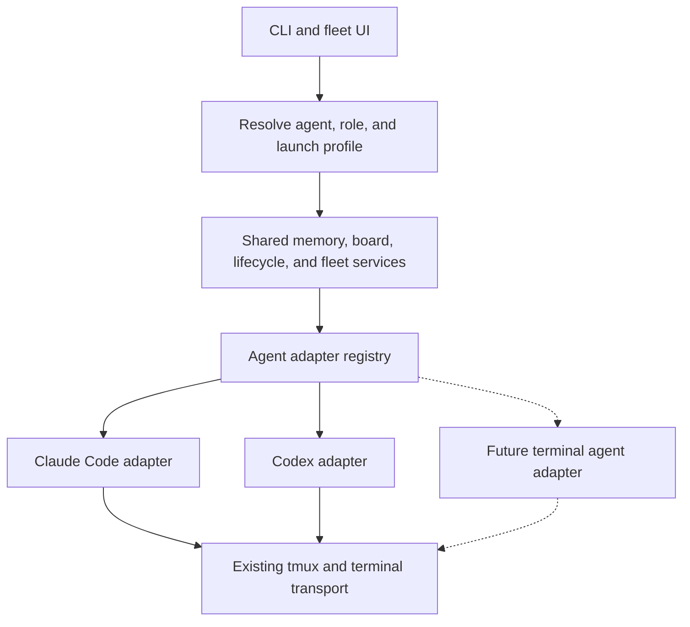

# Terminal coding agent support: shared core, Claude Code and Codex

Status: implemented for draft review in `feat/coding-agent-adapters`.
The audit below describes `main` at `711fd61` on 2026-09-09, before this change.
See [the implementation guide](../coding-agents.md) for shipped behavior,
local validation and external release smoke tests. Scope: terminal coding
agents, including interactive fleet panes.

Codex is currently detectable, but has no working AISquare integration. The
right next step is to extract the Claude integration into an adapter, then
implement Codex against the same contracts. Keep the existing memory, board,
worktree, tmux, and UI infrastructure.

## What exists today

| Area | Current behavior | Evidence |
| --- | --- | --- |
| Detection | Codex has an `AgentSpec` for `~/.codex`, with no context files or settings path. Its spec ignores `CODEX_HOME` and the supplied config-directory override. | [core/agents.py](../../src/aisquare/core/agents.py), `_specs` |
| Connection | A detected Codex installation can be marked connected, but imports zero entries and installs no hooks. The CLI does say “no hooks for this agent”; the connected flag alone does not mean integration works. | [services/agents.py](../../src/aisquare/services/agents.py), `connect`; [cli/common.py](../../src/aisquare/cli/common.py), `emit_connected` |
| Ordinary launch | `launch --command` and role `bin/env/args` bindings can invoke other executables. There is no explicit coding-agent family/default selection. | [cli/launch.py](../../src/aisquare/cli/launch.py); [core/config.py](../../src/aisquare/core/config.py), `RoleLaunchProfile` |
| Team launch and model policy | `team spawn` resolves Claude model ladders, emits `--model` and `--effort`, and its availability probe executes `claude -p` independently of the selected binary. | [core/harness.py](../../src/aisquare/core/harness.py); [cli/team.py](../../src/aisquare/cli/team.py), `spawn` |
| Fleet launch | tmux and worktrees are reusable, but launches append Claude's `--permission-mode`, `--name`, and sometimes `--session-id`; reviewer defaults add `--restricted`. Native-team suppression uses a Claude environment variable. Changing only `--bin` is insufficient. | [services/fleet.py](../../src/aisquare/services/fleet.py), `spawn`; [core/config.py](../../src/aisquare/core/config.py), `FleetRoleSettings` |
| Lifecycle and memory | Installed events, payload handling, account-directory discovery, and prompt attribution assume Claude. There is no Codex lifecycle path. | [cli/hook.py](../../src/aisquare/cli/hook.py); [services/hooks.py](../../src/aisquare/services/hooks.py); [services/team.py](../../src/aisquare/services/team.py), `session_account` |
| Session identity | Board sessions use native agent IDs; fleet linking relies on a preselected native ID. `AISQUARE_FLEET_AGENT` is exported by the fleet but is not consumed to establish a hook-side binding. | [models.py](../../src/aisquare/models.py), `TeamSession` and `FleetAgent`; [services/explainability.py](../../src/aisquare/services/explainability.py), `plan_session_identity` |
| Explainability | Model traffic uses Anthropic environment variables and a proxy explicitly checked for `claude_code` mode. It is not a Codex tracing implementation. | [services/explainability.py](../../src/aisquare/services/explainability.py); [core/spawn.py](../../src/aisquare/core/spawn.py) |
| Setup and diagnostics | The bootstrap installs/updates Claude and connects its hooks. Welcome checks and agent-specific doctor fixes target Claude. `init --agent` already accepts names and can be reused. | [install.sh](../../install.sh); [welcome.py](../../src/aisquare/cli/ui/views/welcome.py); [diagnostics.py](../../src/aisquare/services/diagnostics.py); [onboarding.py](../../src/aisquare/services/onboarding.py) |
| Shared services | Context pools, snapshots, task claims, leases, board events, recall/distillation, CI delivery, and MCP tools already provide substantial reusable logic. MCP is not automatically configured for Codex today. | [services](../../src/aisquare/services); [core/store.py](../../src/aisquare/core/store.py); [services/mcp_server.py](../../src/aisquare/services/mcp_server.py) |

The [previous fleet plan](fleet-tui.md) explicitly deferred Codex in section
8.5. That is a historical scope decision, not evidence that today's Codex lacks
integration facilities. There are no Codex-specific tests in this checkout.

This audit used source inspection and current official documentation. No live
agent sessions or paid model probes were run. This checkout has no `.venv`, and
the available Python lacks the project's runtime/test dependencies, so no
runtime test result is claimed.

## Architecture

Use a small registry of coding-agent adapters. Keep the distinction between a
coding agent (`claude-code`, `codex`), a role (`manager`, `coder`, etc.), an
executable/account profile, and the model that agent runs.



Proposed package: `src/aisquare/core/agent_adapters/`, containing `types.py`,
`registry.py`, `claude_code.py`, `codex.py`, and narrowly shared hook/config
utilities. These are proposed files, not existing modules. Adapters describe
native formats and commands; services orchestrate installation and runtime
behavior. Core adapters must not import services or the UI.

The initial contract should cover:

| Contract | Responsibility |
| --- | --- |
| `AgentInstallation` | Agent family, resolved executable, version, effective config home, and installation identity. |
| `AgentCapabilities` | Supported operations/events, version requirements, and unavailable or unverified features. Separate configured capability from observed readiness. |
| `LaunchRequest` / `LaunchPlan` | Typed launch intent and resolved argv, environment delta, cwd, identity strategy, and explanatory notices. |
| `AgentEvent` / `HookResult` | Normalize session/turn IDs, lifecycle events, model/effort, prompt origin, and context/continuation results at the native boundary. |
| Adapter operations | Discover installation; describe integration files; build new/resume commands; decode events and encode replies; supply model, permission, and tracing policies. |

An internal registry is sufficient initially. A future provider should require
one adapter, registration, provider documentation, and contract fixtures. Use a
synthetic third adapter in tests to demonstrate this without implementing a
speculative plugin-loading system.

Shared code owns role missions, task state, claims, leases, event cursors,
manager wake-up decisions, continuation budgets, context construction, prompt
capture, redaction, snapshots, CI requests, spool handling, git worktrees,
tmux, and terminal rendering. Native argument spelling, hooks/config formats,
account discovery, model catalogs, permission semantics, and tracing transport
belong in adapters. Shared role instructions should request AISquare actions;
agent-specific instructions can be appended by the adapter.

## Selection and configuration

Proposed user-facing commands, not available yet:

```sh
asq agents connect codex
asq agents use codex                   # user default for future sessions
asq agents use codex --project         # preference for this project
asq launch coder --agent codex
asq team bind reviewer --agent claude-code
asq fleet spawn coder --agent codex
```

Store the user default in a new `[agents]` configuration section, project
preference in AISquare's project metadata, and optional `agent` in the existing
`team.profiles.<role>` record. Connecting an agent installs its integration;
selecting an agent sets the launch preference. Both operations report their
own outcome.

Agent selection precedence: explicit `--agent`, role binding, project
preference, inherited AISquare session selection, user default, then the
existing Claude compatibility default. Expose the winning source in JSON and
human-readable status. Pin a running session's agent identity; changing a
default affects future launches. Explicit role bindings allow mixed teams.

Keep the existing binary/env/extra-argument overrides. Exact known executable
names can remain compatibility shorthand when no agent family was explicitly
selected; arbitrary wrappers should declare their family in the role profile.
Resolve family and effective installation before choosing a model or probing
it. Diagnose a conflicting executable/family combination instead of attaching
the wrong agent's flags. Never silently replace a missing selected agent with
Claude.

Persist agent family on session and fleet records. Legacy records retain
their IDs and historical attribution; migrate identifiable Claude records as
Claude, and retain unknown provenance for ambiguous wrappers/MCP sessions.
Preserve existing config, unknown keys, role bindings, and registered sites.

## Codex adapter and parity requirements

**Installation and instructions.** Resolve the explicit directory, effective
profile environment, and `CODEX_HOME`. Import Codex's effective global
instructions into the user pool with source/path attribution; project
instructions stay in the project pool. Respect `AGENTS.override.md` precedence
and nested project guidance. These are documented in [Codex instruction
discovery](https://learn.chatgpt.com/docs/agent-configuration/agents-md).
Preserve user-authored instruction files; use runtime context injection for
AISquare's changing board state. If a reusable AISquare skill is useful, use
the documented [skill locations](https://learn.chatgpt.com/docs/build-skills)
and keep its content shared where possible.

**Lifecycle.** Current Codex documentation includes `SessionStart`,
`UserPromptSubmit`, `Stop`, `SessionEnd`, `PermissionRequest`, and `Interrupt`.
Hooks can live in `hooks.json` beside active config layers. Non-managed hooks
require trust review; changed definitions require review again. End/interrupt
handlers have a three-second ceiling, and Stop can request continuation.
Transcript format is explicitly unstable. See [Codex
hooks](https://learn.chatgpt.com/docs/hooks).

Implement a Codex event adapter that routes those observations to the existing
context, capture, board, metrics, and manager services. Use permission/tool
observations for attention and recovery, with a tested treatment of user-input
tools. Keep native response serialization and output limits in the adapter.
Make end/interrupt processing local and bounded. Label generated continuation
prompts separately from human prompts and deduplicate by native turn/event
identity. Test compaction, resume, interrupted turns, and repeated callbacks.

Connection/status must distinguish installed, configured, awaiting native
trust, observed working, and unavailable. Display Codex's native trust step
when needed; never manufacture trust records. Preserve all unrelated hook
entries, use atomic writes, recognize earlier AISquare hook commands, and
remove only owned entries on disconnect. A directory existing is not proof
that its hooks can execute.

**Identity.** Allocate an AISquare launch/session identity independently of
the native session ID. Bind `(agent family, installation, native session ID)`
to that identity on the first event; propagate a launch token and the existing
fleet ID. Persist the pending binding before process start, so an early hook
cannot race the creation of the tmux/fleet row. Link tracing through that same
binding. Resume retains the binding; a new/forked session gets its own.
Preserve existing Claude IDs and external session references during migration.
Do not infer identity from a “latest session” file or tmux title. Test two
concurrent launches, different config homes, and late/replayed events.

**Launch and permissions.** Build interactive and resume argv through Codex's
adapter. Keep native interactive Codex in the existing terminal pane. For
scripted jobs, use the documented `codex exec --json` event stream and explicit
resume IDs. Its documented events include thread and turn lifecycle plus
usage, giving structured automation a separate parser. See [CLI
reference](https://learn.chatgpt.com/docs/developer-commands?surface=cli) and
[non-interactive mode](https://learn.chatgpt.com/docs/non-interactive-mode).
Headless parsing must not replace the interactive fleet experience.

Represent write scope and approval behavior separately. Map role intent to
agent-native policy, retaining native options as an escape hatch. A reviewer
gets read-only intent rather than a copied Claude flag. In the Codex adapter,
configure reasoning via `model_reasoning_effort` and sandbox/approval settings
using the supported configuration surface. Native subagent suppression also
needs its Codex-specific setting. See [Codex configuration
reference](https://learn.chatgpt.com/docs/config-file/config-reference).
Validate combinations for the supported version; do not reinterpret Claude
`auto` or `ultracode` as a supposedly equivalent Codex mode.

**Models and role behavior.** Separate role mission/depth from native model
ladders. Give each adapter its own configurable role defaults, model/effort
validation, and availability mechanism. Cache availability by agent, binary,
version, effective installation/provider, and model. Check the selected
installation, never a hard-coded `claude` executable. Explicit model pins
remain explicit; report unsupported/unavailable selections. Keep discovery
and doctor free of paid model requests, and preserve the probe opt-out.

**Fleet control.** Reuse spawn, worktrees, attach, tell, stop, reap, pause,
resume, and restart. Launch labels can remain AISquare/tmux metadata when an
agent has no equivalent name option. Gate automated input on confirmed
readiness; preserve the existing board-message fallback when a session is
busy, needs approval, or cannot be identified. Test paste, escape keys, resize,
EOF, signals, and return-to-shell behavior with Codex. Reuse the manager's
event selection, cursors, pause signal, and loop guards through the normalized
continuation contract.

**MCP and CI.** Reuse the existing stdio MCP server and tools; add Codex
connection configuration when that optional integration is requested. Local
MCP calls from a launched agent should reuse its session binding instead of
creating an unrelated `mcp:remote` teammate. Preserve virtual identities for
external clients. Feed normalized session/prompt events into the existing CI
delivery contract, preserving its off state, time budgets, failure reasons,
and redaction. Changes to server payload schemas require coordinated versioning.

**Explainability.** Keep prompt/event shipping, redaction, run records, and
board joins shared. Separate these from native model-traffic tracing. Evaluate
Codex's documented OpenTelemetry export first; it avoids changing model
routing. If full existing trace coverage needs a gateway, verify or implement
OpenAI Responses support in the SDK/gateway, including its used streaming
transport. Codex documents both OTEL configuration and Responses provider
settings in the [configuration
reference](https://learn.chatgpt.com/docs/config-file/config-reference).
The external gateway's Codex readiness was not established by this repo audit.

Require evidence for session/run correlation, model/tool spans, token usage,
and both supported login modes before claiming equivalent tracing. Never mark
Codex traced because Anthropic variables were set. Preserve operator-owned
routing and the existing opt-in behavior. Extend the process-spawn inventory
and identity stripping to every new path. If SDK/gateway work is necessary,
track it as a dependency of complete parity, not as an unmentioned omission.

## Delivery sequence

Each implementation PR should leave the Claude workflow usable and pass
`make check` in a configured development environment.

| Phase | Deliverable | Exit criterion |
| --- | --- | --- |
| 0. Verify the native contract | Pick a supported released Codex version; record hooks/trust, interactive/resume behavior, permissions, login modes, and tracing evidence. Inventory current Claude behaviors and add representative native fixtures. | Every parity item has a verified transport or a named implementation dependency. No undocumented `codex queue` assumption. |
| 1. Extract Claude and shared contracts | Add adapter types/registry, move native Claude hooks/flags/model rules behind it, and introduce one launch-planning service used by launch/team/fleet. Preserve each entry point's documented defaults. | Existing Claude integration and regression tests pass; recording a launch plan requires no live agent. |
| 2. Add selection and identity | Add defaults, role family bindings, additive store migrations, session binding, and agent-aware status. Preserve old config and hook entry points. | Legacy projects work; mixed role bindings resolve deterministically; launch/event races cannot merge sessions. |
| 3. Complete Codex local integration | Implement connect/disconnect, context import, lifecycle adaptation, prompt provenance, model policy, permissions, launch/resume, manager continuation, and terminal control. | A Codex-only project completes the same memory/task/fleet workflow as Claude; mixed teams exchange board updates correctly. |
| 4. Finish MCP, CI, and explainability | Wire optional MCP to the real session, run CI contract tests for both agents, and complete Codex telemetry plus any SDK/gateway dependency. | No false connected/traced states; enabled features have end-to-end evidence; disabled integrations remain inert. |
| 5. Deliver setup and release | Update POSIX installer and Windows/WSL forwarding, init/doctor/fix flows, welcome/settings/spawn UI, help/JSON output, docs, and compatibility matrix. | A machine with only Codex can install, connect, select, diagnose, launch, and use the fleet without needing Claude. |

Phase 0 should be a short compatibility spike. Tracing dependency discovery
belongs there so it can inform the remaining work. This is several reviewable
PRs; a reliable calendar estimate depends on that spike, particularly gateway
compatibility and native attention/terminal behavior.

## Acceptance and validation

The release bar is parity in AISquare outcomes, with native differences
documented. Detection or a running tmux pane alone is insufficient.

1. Run a common adapter contract suite for Claude and Codex: selection, argv,
   environment/profile resolution, owned config merge/removal, event decoding,
   context output, continuation, resume identity, and capability diagnostics.
2. Drive both adapters with versioned native fixtures and fake executable/tmux
   boundaries. Verify no Claude flags, model aliases, or tracing settings leak
   into Codex; use a minimal third adapter to catch coupling in shared services.
3. Extend existing launch/profile, hook, fleet, manager, CI, MCP, correlation,
   config-preservation, migration-race, spawn-inventory, no-network, and
   fail-open regression suites. Verify malformed data, duplicates, concurrent
   sessions, early hooks, missing binaries, and unavailable integrations.
4. Run real terminal smoke tests for fresh/resumed Codex and Claude sessions,
   alternate config homes, worktrees, approval prompts, manager wake-ups,
   signals, restart, and mixed teams. Record the exact binary versions used.
5. Verify clean-machine setup with Codex only, Claude only, both installed, and
   neither installed. Cover the supported Linux/macOS/WSL fleet environments;
   retain the current tmux platform boundary.
6. Complete an end-to-end parity checklist: context at session start and after
   compaction; human prompt history; live board state; task claim/review/release;
   bounded manager continuation; accurate model/effort; optional MCP/CI;
   correctly correlated explainability; and preserved user configuration after
   reconnect/disconnect and upgrade.

Gemini CLI or another terminal agent can follow by satisfying this contract.
Antigravity support is conditional on a usable terminal interface; desktop/IDE
automation is outside this scope. No support claim for either is made here.
